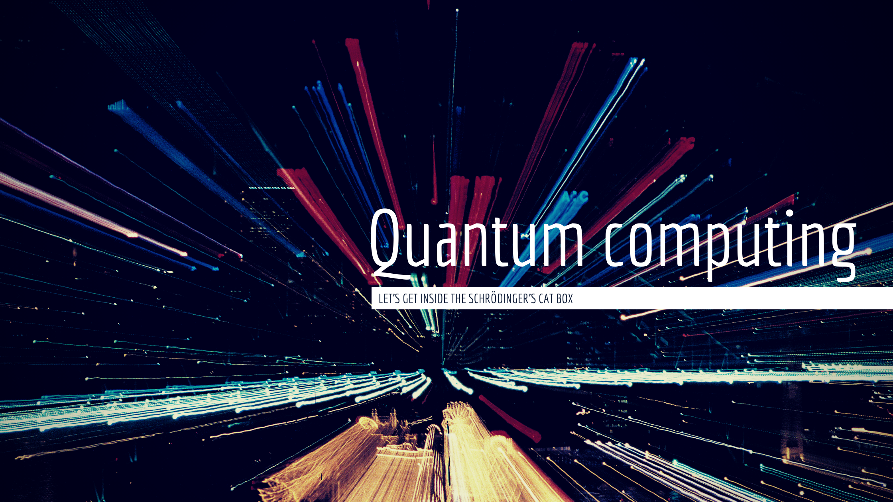

# Quantum-Computing

## What is Quantum computing
* [Qiskit Documentation](https://qiskit.org/documentation/index.html)
    * [Qiskit textbook](https://qiskit.org/textbook/preface.html)
    * [Qiskit ML tutorials](https://github.com/qiskit-community/qiskit-community-tutorials/tree/master/machine_learning)
    * [Qiskit Aqua](https://github.com/Qiskit/qiskit-aqua)
* [Quirk](https://github.com/Strilanc/Quirk)
* [TensorFlow Quantum](https://github.com/tensorflow/quantum)
* [QiskitBlocks](https://github.com/JavaFXpert/QiskitBlocks)
* [Creating infinite worlds with quantum computing](https://medium.com/qiskit/creating-infinite-worlds-with-quantum-computing-5e998e6d21c2)

## Videos
* [IBM Qiskit Advocate와 함께 하는 - Quantum Computing 101](https://youtu.be/SEfG5GJ4f7w)
* [양자 컴퓨터에 관한 짧은 역사 (자막)](https://youtu.be/HaeJ8Q8TKxA)
* [양자컴퓨터의 기초와 그루버 알고리즘](https://youtu.be/EuAjgGHqJ5A)
